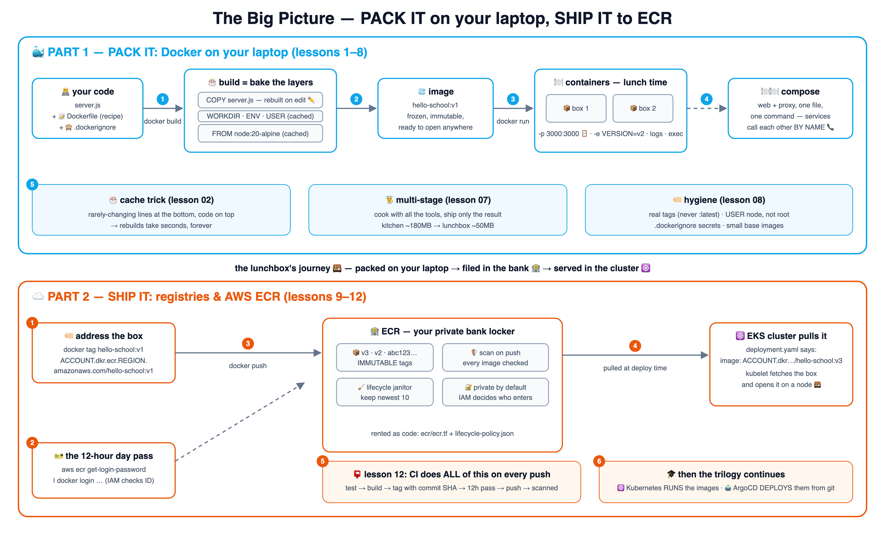

# 🍱 Learn Docker & ECR the School Way

Course **1 of 3** in the school trilogy — this one teaches **how apps get packed and shipped**:

1. 🍱 **learn-docker-school** (this repo) — containers, images, Dockerfiles, compose, ECR
2. ☸️ [learn-kubernetes-school](https://github.com/BaluRaut/learn-kubernetes-school) — what *runs* those images at scale
3. 🤖 [learn-argocd-school](https://github.com/BaluRaut/learn-argocd-school) — what *deploys* them and keeps clusters honest

🌐 **Interactive site:** **<https://baluraut.github.io/learn-docker-school/>** — lesson cards,
every lesson as a numbered diagram, and the one big-picture 4K diagram.

## 🗺️ The big picture — one diagram, both worlds



## 🎓 The 12 lessons

Each numbered branch adds ONE lesson folder (`lessons/NN-topic/README.md`) with an
explain-like-I'm-5 story, a school analogy, a diagram, **What / Why / How**, and hands-on
commands using this repo's real files. Branches are **sequential** — branch 07 contains
lessons 01–07.

```bash
git checkout lesson-01-why-containers   # read lessons/01-why-containers/README.md, then...
git checkout lesson-02-images-layers    # ...keep going, one branch at a time
```

### Part 1 — Docker on your laptop 🐳

| # | Branch | You learn | Analogy |
|---|---|---|---|
| 01 | `lesson-01-why-containers` | Why containers exist; containers vs VMs | The packed lunchbox 🍱 |
| 02 | `lesson-02-images-layers` | Images, layers & the build cache | A layer cake 🎂 |
| 03 | `lesson-03-dockerfile` | Writing a Dockerfile line by line | The recipe card 📝 |
| 04 | `lesson-04-run-containers` | run/stop/logs/exec, ports, env vars | Lunch time 🍽️ |
| 05 | `lesson-05-volumes-networks` | Volumes & container networking | Shared fridge 🧊 + intercom 📞 |
| 06 | `lesson-06-docker-compose` | Multi-container apps in one file | Setting the whole table 🍽️🍽️ |
| 07 | `lesson-07-multi-stage` | Multi-stage builds — tiny images | Cook in the kitchen, pack only food 👨‍🍳 |
| 08 | `lesson-08-image-hygiene` | Tags, .dockerignore, non-root, size | Label your boxes properly 🏷️ |

### Part 2 — Registries & AWS ECR ☁️

| # | Branch | You learn | Analogy |
|---|---|---|---|
| 09 | `lesson-09-registries` | What a registry is; pull/push; digests | The frozen-lunchbox warehouse 🏬 |
| 10 | `lesson-10-ecr-setup` | Creating an ECR repo; the 12-hour login | Renting a bank locker 🏦 |
| 11 | `lesson-11-push-pull-lifecycle` | Tagging for ECR, push/pull, janitor rules | Filing boxes + the janitor 🧹 |
| 12 | `lesson-12-ci-to-cloud` | CI builds & pushes; handoff to k8s/ArgoCD | The courier files the copies 📮 |

## 📦 What's in this repo (main branch)

```
learn-docker-school/
├── app/
│   ├── server.js            # zero-dependency demo web app (shows its hostname)
│   ├── Dockerfile           # the single-stage recipe, heavily commented
│   ├── Dockerfile.multi     # the multi-stage recipe (lesson 07)
│   ├── generate.js          # the "build step" for the multi-stage demo
│   └── .dockerignore        # lesson 08
├── proxy/nginx.conf         # compose demo: routes to 'web' BY NAME
├── compose.yml              # the whole lunch table in one command
├── ecr/                     # ECR as code: repo + lifecycle (janitor) policy
└── docs/                    # the GitHub Pages site
```

Part 1 needs only **Docker Desktop** — no cloud, no cost. Part 2 uses a real AWS account
for ECR (pennies for a private repo; the lessons show cleanup too).

## 🚀 Quickest possible taste (2 min)

```bash
docker build -t hello-school:v1 app/
docker run --rm -p 3000:3000 hello-school:v1
# another terminal:
curl localhost:3000        # 🍱 hello from <container-id>
```
