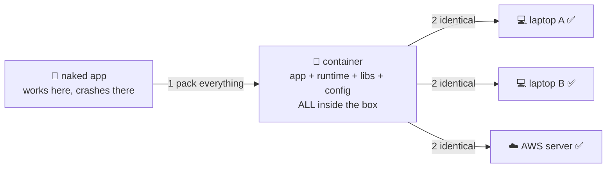

# 🍱 Lesson 01 — Why containers: the end of "works on my machine"

**📍 You are here:** Lesson **01** of 12 · Next: `lesson-02-images-layers`

---

## 📦 What's in this branch

The foundation of everything: **what a container is and why it exists**. Real files:

- [app/server.js](../../app/server.js) — the demo app for the whole course (zero dependencies, shows its hostname)
- [app/Dockerfile](../../app/Dockerfile) — its recipe (lesson 03 reads it line by line)

## 🧒 Explain like I'm 5

Your app runs great on YOUR laptop. You send it to a friend… 💥 crash. Their
laptop has Node 14, yours has Node 20. They're missing a library. Their paths
are different. Sound familiar? 😤

Now imagine your mom packs you a **lunchbox** 🍱 — rice, curry, spoon, napkin,
*everything you need, inside the box*. It doesn't matter whose house you open
it in: lunch is identical.

A **container** is a lunchbox for your program: the app + Node 20 + libraries
+ settings, all sealed inside. Your laptop, your friend's laptop, a giant AWS
server — same box, same lunch, every time.

One more secret: it's NOT a mini-computer-in-a-computer (that's a **virtual
machine** — an entire house shipped in a truck 🚚). A container shares your
machine's Linux kernel and just isolates the app — which is why it starts in
milliseconds and weighs megabytes, not gigabytes.

## 🗺️ Diagram



## ❓ What

- **Container** = an isolated process with its own filesystem, network view
  and dependencies, sharing the host's kernel.
- **VM vs container**: a VM boots a whole OS (minutes, GBs); a container
  starts one process (milliseconds, MBs). Different tools for different jobs.
- **Docker** = the toolbox that builds, runs and ships containers. Not the
  only one, but the one everyone learns first.

## 🤔 Why

Every tool in the trilogy stands on this: Kubernetes schedules *containers*,
ECR stores *container images*, ArgoCD deploys manifests that run *containers*.
If the lunchbox idea is solid, everything later is just logistics. 🚚

## 🔧 How (in this repo)

[app/server.js](../../app/server.js) is deliberately dependency-free — one
file, plain Node. It answers with its **hostname**, so when you later run 3
copies you can literally see which box replied. That little trick carries
through all three courses.

## 🧪 Try it

```bash
# 0) install Docker Desktop, then prove the pain is real:
node app/server.js          # works IF you happen to have Node 20... maybe you don't!
                            # ^ that's exactly the problem containers solve

# 1) now the lunchbox way — no Node needed on your machine at all:
docker run --rm -p 3000:3000 -v "$PWD/app":/app -w /app node:20-alpine node server.js
curl localhost:3000         # 🍱 hello from <container-id>

# 2) peek behind the curtain:
docker ps                   # your running box
docker version              # client + engine
```

## ⏭️ Next

That `node:20-alpine` thing we just used is an **image** — a frozen lunchbox
made of stacked **layers**. Time to meet the cake. 🎂

```bash
git checkout lesson-02-images-layers
```
