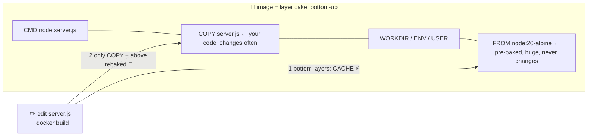

# 🎂 Lesson 02 — Images & layers: the cake and the cache

**📍 You are here:** Lesson **02** of 12 · Previous: `lesson-01-why-containers` · Next: `lesson-03-dockerfile`

---

## 📦 What's in this branch

Lesson 01, **plus**: what an **image** actually is inside — stacked **layers** —
and why understanding this makes your builds 100× faster. Real file:

- [app/Dockerfile](../../app/Dockerfile) — each line below bakes one layer

## 🧒 Explain like I'm 5

An image isn't one solid block — it's a **layer cake** 🎂, baked bottom-up,
one Dockerfile line per layer:

- **Bottom layer**: tiny Linux + Node (`FROM node:20-alpine`) — a *pre-baked*
  layer from the bakery. You never bake this yourself.
- **Middle layers**: your settings (`WORKDIR`, `ENV`, `USER`).
- **Top layer**: your code (`COPY server.js`).

And the magic rule of the bakery: **a layer that didn't change is never baked
again** — it's taken from the **cache** shelf, instantly.

So when you edit `server.js` and rebuild:
- bottom + middle layers → from cache, 0 seconds ⚡
- only the `COPY` layer and above → rebaked 🔨

That's why pros put **rarely-changing lines at the bottom** and **code at the
top** — so daily rebuilds touch only the thin top layer. Cake architecture is
build speed. 🎂⚡

## 🗺️ Diagram



## ❓ What

- **Image** = an ordered stack of read-only layers + metadata (what to run,
  which ports, which user). Frozen; never changes after build.
- **Layer** = the filesystem diff produced by one Dockerfile instruction.
  Layers are content-addressed and **shared** between images — ten images on
  `node:20-alpine` store that base **once** on disk.
- **Build cache**: Docker reuses a layer if the instruction AND its inputs
  are unchanged. First changed line **invalidates everything above it**.
- **Container** = a thin *writable* layer on top of the frozen stack — that's
  why 100 containers from one image are cheap.

## 🤔 Why

Cache-friendly Dockerfiles are the difference between 2-second and 5-minute
rebuilds — hundreds of times a week. And shared layers are why pulling your
tenth Node app is instant: the fat base layer is already on the machine.
(Lesson 11: pushes upload only layers the registry doesn't have — same idea.)

## 🔧 How (in this repo)

[app/Dockerfile](../../app/Dockerfile) is cache-ordered on purpose: `FROM` →
`WORKDIR` → `COPY server.js` → `ENV/EXPOSE/USER/CMD`. In bigger apps the
classic move is: `COPY package.json` + `RUN npm ci` **before** `COPY . .` —
so editing code never re-runs dependency install.

## 🧪 Try it

```bash
docker build -t hello-school:v1 app/     # first build: every layer baked
docker build -t hello-school:v1 app/     # again: ALL "CACHED" — ~1 second ⚡

echo "// tweak" >> app/server.js
docker build -t hello-school:v1 app/     # watch: FROM/WORKDIR cached, COPY rebuilt
git checkout app/server.js               # undo the tweak

docker history hello-school:v1           # 🎂 the actual layers + sizes
docker image ls | head -3                # images on your shelf
```

## ⏭️ Next

Time to read the recipe card itself, line by line: **the Dockerfile**.

```bash
git checkout lesson-03-dockerfile
```
