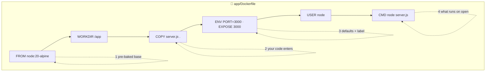

# 📝 Lesson 03 — The Dockerfile: reading the recipe card

**📍 You are here:** Lesson **03** of 12 · Previous: `lesson-02-images-layers` · Next: `lesson-04-run-containers`

---

## 📦 What's in this branch

Lessons 01–02, **plus**: the **Dockerfile**, line by line. Seven instructions
cover most Dockerfiles you'll ever read. Real file:

- [app/Dockerfile](../../app/Dockerfile) — heavily commented, this lesson's textbook

## 🧒 Explain like I'm 5

Mom's recipe card 📝 for packing your lunchbox:

1. *"Start with the plain box from the shop"* — `FROM node:20-alpine`.
   Never build a box from raw plastic; start from a good pre-made one.
2. *"Work at the kitchen counter"* — `WORKDIR /app`. All later steps happen there.
3. *"Put the food in"* — `COPY server.js .` — YOUR stuff enters the box.
4. *"Tape the default settings to the lid"* — `ENV PORT=3000`. Can be changed
   at lunch time without re-packing.
5. *"Write 'opens at window 3000' on the label"* — `EXPOSE 3000`. Just a
   label for humans — it doesn't open anything by itself!
6. *"This box belongs to the kid, not the principal"* — `USER node`. Don't
   give the box superpowers it doesn't need.
7. *"When the box is opened, eat like THIS"* — `CMD ["node","server.js"]`.
   One box, one dish: a container runs **one main process**, in the
   foreground. When that process ends, lunch is over.

## 🗺️ Diagram



## ❓ What

- `FROM` — the base image (always pin a version: `node:20-alpine`, never bare `node`).
- `WORKDIR` — cd for all following steps (creates the dir too).
- `COPY` — files from *build context* → image. `.dockerignore` filters the context.
- `RUN` — execute a command AT BUILD TIME (install deps, compile). We don't
  need one — zero dependencies! Bigger apps: `RUN npm ci`.
- `ENV` — default env vars, overridable at run time (`-e`).
- `EXPOSE` — documentation of the listening port (the real opening is `-p`, lesson 04).
- `USER` — which user runs the process (lesson 08: never root).
- `CMD` — the default command on start. `ENTRYPOINT` is its stricter cousin —
  meet it when you need it, not before.
- **Build time vs run time** is THE mental split: `RUN` happens once at build;
  `CMD`/`ENV` matter every time a container starts.

### 🧠 The instruction table (eight you will meet immediately)

| Instruction | Purpose | When it runs |
|---|---|---|
| `FROM` | base image | build |
| `WORKDIR` | working directory for later steps | build |
| `COPY` | copy files from the build context | build |
| `RUN` | execute a command (install, compile) | **build** |
| `ENV` | environment defaults | build → visible at run |
| `EXPOSE` | *documents* the container port | (metadata only) |
| `USER` | user the process runs as | run |
| `CMD` | default command | **run** (container start) |

> **`EXPOSE` does not publish a port.** Only `-p host:container` (lesson 04)
> opens a door. `EXPOSE` is a label on the box.

## 🤔 Why

The Dockerfile is executable documentation: anyone can rebuild your exact
environment from it. It's also the file every CI pipeline (k8s course!),
every review, every debugging session starts from. Reading one fluently is a
superpower cheaply bought.

## 🔧 How (in this repo)

Open [app/Dockerfile](../../app/Dockerfile) — every line carries a comment
version of this lesson. Note what's **missing** too: no `RUN npm install`
(no deps), no secrets (never bake secrets into layers — they're in the cake
forever, lesson 08!).

## 🧪 Try it

```bash
docker build -t hello-school:v1 app/          # bake from the recipe
docker run --rm -p 3000:3000 hello-school:v1  # open the box
curl localhost:3000                           # 🍱 hello from <hostname>

# prove ENV defaults are overridable without rebuilding:
docker run --rm -p 3000:3000 -e APP_VERSION=recipe-test hello-school:v1
curl localhost:3000                           # version: recipe-test

# inspect the metadata your Dockerfile wrote:
docker inspect hello-school:v1 --format '{{.Config.User}} {{.Config.Env}} {{.Config.Cmd}}'
```

### ⚠️ Common mistakes

- `EXPOSE` does not publish a port — `-p` does
- `RUN` happens at **build** time; `CMD` happens when the container **starts**
- unpinned `FROM node` — a different base tomorrow, a different bug tomorrow
- `COPY . .` before `.dockerignore` exists (lesson 08)

## ⏭️ Next

The box is baked. Now we get serious about **opening** it: ports, env vars,
logs, exec, stop — the daily verbs.

```bash
git checkout lesson-04-run-containers
```
