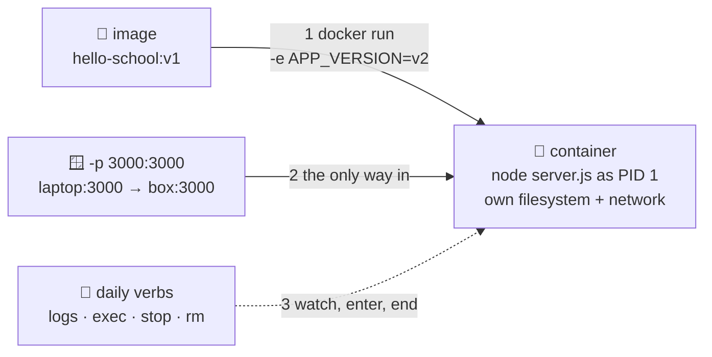

# 🍽️ Lesson 04 — Running containers: lunch time

**📍 You are here:** Lesson **04** of 12 · Previous: `lesson-03-dockerfile` · Next: `lesson-05-volumes-networks`

---

## 📦 What's in this branch

Lessons 01–03, **plus**: the daily verbs — `run`, `ps`, `logs`, `exec`,
`stop`, `rm` — and the two flags you'll type forever: `-p` and `-e`.

## 🧒 Explain like I'm 5

Lunch time! 🍽️ Opening boxes has rules:

- **The serving window** 🪟 (`-p 3000:3000`): the box eats at its own table
  (its private network). For YOU to reach it, the cafeteria opens a window:
  *"window 3000 on the laptop leads to seat 3000 in the box"*. Left number =
  your laptop; right = inside the box. `-p 8080:3000` works too — outside
  window 8080, same seat inside.
- **Last-minute notes on the lid** ✏️ (`-e APP_VERSION=v2`): change settings
  at open time without re-packing the box.
- **Peeking** 👀: `docker logs` = read the box's diary; `docker exec -it … sh`
  = climb inside a *running* box and look around.
- **Cleaning up** 🧹: `docker stop` = politely say "lunch is over" (SIGTERM —
  our app says "bye 👋"); `docker rm` = throw away the box; `--rm` = a box
  that throws itself away. Boxes are disposable — never precious.

## 🗺️ Diagram



## ❓ What

- `docker run IMAGE` = create + start a container. Useful flags:
  `--rm` (self-clean), `-d` (background), `--name` (findable), `-p`, `-e`.
- A container lives exactly as long as its **main process** (PID 1). Process
  exits → container exits. There is no "the container is up but the app is
  down" — that's the whole point.
- `docker ps` (running), `ps -a` (also exited), `logs -f` (follow the diary),
  `exec -it NAME sh` (shell inside), `stop` (SIGTERM, 10s grace, then KILL).

### 🧠 The container lifecycle

```text
docker create  →  created
docker start   →  running
docker stop    →  stopped   (process gone, filesystem kept)
docker rm      →  removed   (container gone)
```

Three verbs beginners mix up:

```text
docker stop  = stop the process        (container still exists)
docker rm    = remove the container    (its writable layer is gone)
docker rmi   = remove the IMAGE        (the template, from your machine)
```

`docker run` = create + start in one go. `docker ps -a` shows the stopped
ones you forgot; `docker system df` shows what all of it costs on disk.

## 🤔 Why

These verbs ARE your debugging toolkit for everything later: a crashing pod in
Kubernetes is investigated with the same ideas (`kubectl logs`, `kubectl exec`
are literal cousins). And the PID-1/SIGTERM story is why our
[server.js](../../app/server.js) handles SIGTERM — the same handler that makes
zero-downtime rollouts graceful in the k8s course.

## 🔧 How (in this repo)

[app/server.js](../../app/server.js) logs every request (for `docker logs`),
prints its version (for `-e`), and handles SIGTERM (for `docker stop`). It's
a playground for exactly this lesson.

## 🧪 Try it

```bash
docker build -t hello-school:v1 app/

# background + named + windowed + note-on-the-lid:
docker run -d --name lunch -p 3000:3000 -e APP_VERSION=lunch-time hello-school:v1
curl localhost:3000                       # version: lunch-time
curl localhost:3000                       # visits: 2 — state lives IN the box

docker logs -f lunch                      # the diary (Ctrl+C to stop following)
docker exec -it lunch sh                  # climb in: ls, ps, cat server.js, exit

docker stop lunch                         # watch the diary say "bye 👋" (SIGTERM!)
docker rm lunch                           # throw the box away
docker run --rm -p 3000:3000 hello-school:v1   # visits: 1 again — new box, fresh memory
```

### ⚠️ Common mistakes

- `docker stop` ≠ `docker rm` ≠ `docker rmi` — process, container, image
- forgetting `-p` and wondering why `localhost:3000` is silent
- running with `-d` and never reading `docker logs` — the container "did nothing" because it crashed

## ⏭️ Next

"New box, fresh memory" is great for apps, terrible for data. And how do TWO
boxes talk to each other? **Volumes & networks.**

```bash
git checkout lesson-05-volumes-networks
```
