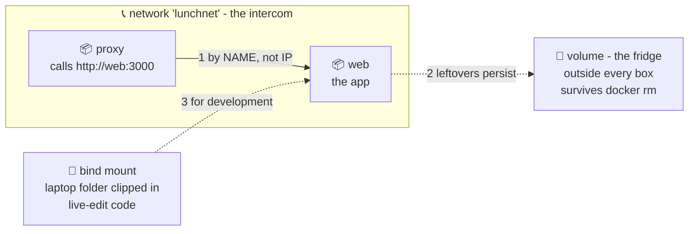

# 🧊📞 Lesson 05 — Volumes & networks: the shared fridge and the intercom

**📍 You are here:** Lesson **05** of 12 · Previous: `lesson-04-run-containers` · Next: `lesson-06-docker-compose`

---

## 📦 What's in this branch

Lessons 01–04, **plus**: how data **survives** disposable containers
(volumes), and how containers **find each other** (networks). Real file:

- [proxy/nginx.conf](../../proxy/nginx.conf) — calls another container *by name* (lesson 06 uses it)

## 🧒 Explain like I'm 5

Two problems from lunch time:

**Problem 1: the box forgets.** 🧠 Lesson 04 ended with "new box, fresh
memory" — the visit counter reset. Fine for apps, catastrophic for databases!
Solution: the **shared fridge** 🧊 (a **volume**). The fridge stands OUTSIDE
the boxes. A box stores its leftovers in the fridge; the box gets thrown away;
the NEXT box opens the same fridge — leftovers still there. Fridges survive
boxes. (Sound familiar? The k8s course tells this exact story with PVCs —
backpack vs library shelf. Same physics.)

**Problem 2: boxes can't hear each other.** Each box eats at its own private
table. For the proxy box to call the app box, they must join the same
**intercom system** 📞 (a **network**). And here's the beautiful part: on a
shared network, boxes call each other **by NAME** — `http://web:3000` — not
by IP. Names stay; IPs are for machines.

Plus a third trick for developers: the **bind mount** 📂 — clip a *laptop
folder* into the box (`-v $PWD/app:/app`). Edit the file on your laptop; the
box sees it instantly. That's how lesson 01's very first command worked!

## 🗺️ Diagram



## ❓ What

- **Named volume** (`docker volume create data`, `-v data:/somewhere`) —
  Docker-managed storage, survives container removal. For databases & state.
- **Bind mount** (`-v /laptop/path:/container/path`) — a real host folder
  mapped in. For dev loops and config files.
- **Network** (`docker network create lunchnet`, `--network lunchnet`) —
  containers on the same network reach each other by **container name**
  via Docker's built-in DNS. The default `bridge` network notably does NOT
  do name resolution — always make a named network.

## 🤔 Why

Volumes split the world into *disposable* (containers) and *precious* (data) —
the split every later technology respects (k8s lesson 12 is this exact idea at
cluster scale). Networks-with-names is the seed of service discovery:
`http://web:3000` here becomes `http://school-api` in Kubernetes — same
pattern, bigger school.

## 🧪 Try it

```bash
docker build -t hello-school:v1 app/

# --- the intercom 📞 ---
docker network create lunchnet
docker run -d --name web --network lunchnet hello-school:v1     # note: no -p needed!
docker run --rm --network lunchnet curlimages/curl -s http://web:3000
# 🍱 hello from web — found BY NAME across containers 🎉

# --- the fridge 🧊 ---
docker volume create fridge
docker run --rm -v fridge:/data alpine sh -c 'echo leftovers > /data/note.txt'
docker run --rm -v fridge:/data alpine cat /data/note.txt        # different box, same fridge!

# --- cleanup ---
docker rm -f web && docker network rm lunchnet && docker volume rm fridge
```

## ⏭️ Next

Network + two containers + config + ports… typing all those flags daily gets
old fast. One YAML file to set the whole table: **Docker Compose**.

```bash
git checkout lesson-06-docker-compose
```
