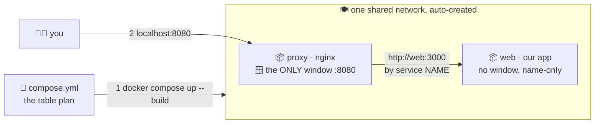

# 🍽️🍽️ Lesson 06 — Docker Compose: set the whole table with one command

**📍 You are here:** Lesson **06** of 12 · Previous: `lesson-05-volumes-networks` · Next: `lesson-07-multi-stage`

---

## 📦 What's in this branch

Lessons 01–05, **plus**: **Compose** — everything from lesson 05, declared in
one file instead of typed as flags. Real files:

- [compose.yml](../../compose.yml) — the table plan: `web` + `proxy`
- [proxy/nginx.conf](../../proxy/nginx.conf) — proxy forwards to `http://web:3000` by name

## 🧒 Explain like I'm 5

Yesterday you set the lunch table by hand: make a network, run box 1 with
these flags, run box 2 with those flags, connect the fridge… 15 minutes of
flag-typing, and your teammate does it *slightly differently* and nothing
works. 😩

**Compose** is the laminated **table plan** 🍽️: one sheet that says *"this
table has a web box and a proxy box, they share the intercom, only the proxy
has a serving window, here's the fridge."* Then:

- `docker compose up` — the whole table appears, exactly as drawn. ✨
- `docker compose down` — the whole table vanishes.
- Your teammate runs the same file → the **identical** table. No drift
  between laptops. (Recognize the theme? Declared state > typed commands —
  the same idea GitOps applies to whole clusters in the ArgoCD course.)

Our table: the **proxy** is the only box with a window (`8080:80`); it
forwards everyone to **web** by name. `web` itself has NO window — reachable
only through the proxy, like a kitchen behind the counter.

## 🗺️ Diagram



## ❓ What

- `services:` — each entry becomes a container; the service **name** is its
  DNS name on the auto-created network.
- `build: ./app` vs `image: nginx:alpine` — bake ours, buy theirs.
- `ports:` only where the outside world enters; internal services stay
  windowless (smaller attack surface — hygiene, lesson 08!).
- `volumes:` — our proxy bind-mounts its config read-only (`:ro`).
- `depends_on:` — start order (web before proxy). Start ≠ ready — real
  readiness is what k8s probes solve properly (k8s course, lesson 07).
- Daily verbs: `up --build`, `down`, `ps`, `logs -f web`, `exec web sh`.

### 🧠 Compose describes a desired application topology

```text
compose.yml
web
 ├── depends_on → api
 │                 └── db
 └── network: app-net (everyone by name)
```

The five commands you'll type daily:

```bash
docker compose up -d      # create + start the whole table, detached
docker compose ps         # who's up
docker compose logs -f    # everyone's output, tailed
docker compose exec web sh   # a shell inside one service
docker compose down       # stop + remove (add -v to drop volumes)
```

> `depends_on` controls **start order** only. It does **not** mean the
> dependency is ready to accept traffic — `db` may be "started" and still
> initializing. For readiness use a `healthcheck` + `condition:
> service_healthy`, or make the app retry. (Kubernetes solves the same
> problem with readiness probes.)

## 🤔 Why

Compose is where "my dev setup" becomes **a file in git** — reviewable,
shareable, versioned. It's also the best mental bridge to Kubernetes: a
Compose service ≈ Deployment + Service, the shared network ≈ cluster DNS.
Learn the small school, and the big school feels familiar.

## 🧪 Try it

```bash
docker compose up --build          # the whole table, one command
# open http://localhost:8080       # → proxy → web, by name 🎉

curl localhost:8080                # 🍱 hello from <web's container id>
curl localhost:3000 || echo "web has NO window — exactly as planned 🙅"

docker compose ps                  # the table's seating chart
docker compose logs -f web         # one box's diary (Ctrl+C)
docker compose down                # table vanishes, nothing left behind
```

### ⚠️ Common mistakes

- `depends_on` = start order, not readiness — the app must retry or use healthchecks
- exposing every service's port to the host — only the front door needs `ports:`
- `docker compose down -v` in the wrong directory — it deletes that project's volumes

## ⏭️ Next

Our image is small because the app has zero dependencies. Real apps have build
steps and heavy tools — and there's a trick to keep images tiny anyway:
**multi-stage builds**.

```bash
git checkout lesson-07-multi-stage
```
