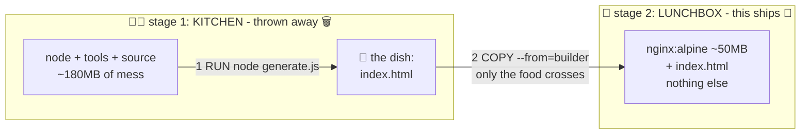

# 👨‍🍳 Lesson 07 — Multi-stage builds: cook in the kitchen, pack only the food

**📍 You are here:** Lesson **07** of 12 · Previous: `lesson-06-docker-compose` · Next: `lesson-08-image-hygiene`

---

## 📦 What's in this branch

Lessons 01–06, **plus**: the single best trick for small, safe images —
**multi-stage builds**. Real files:

- [app/Dockerfile.multi](../../app/Dockerfile.multi) — a working two-stage build
- [app/generate.js](../../app/generate.js) — the pretend "build step"

## 🧒 Explain like I'm 5

To make lunch you need a **big messy kitchen** 👨‍🍳: oven, mixer, flour
everywhere, recipe drafts, dirty spoons.

Question: when you pack the lunchbox… do you put **the oven in the box**? 🤨

Of course not! Yet that's exactly what naive Dockerfiles do: compilers,
package managers, source code, build caches — all shipped to production
inside the image. The customer ordered lunch; you mailed them your kitchen.

**Multi-stage** fixes it with two rooms in one recipe:

1. **Stage 1 — the KITCHEN** (`FROM node:20-alpine AS builder`): all tools
   allowed, make as much mess as needed, produce the dish (`index.html`).
2. **Stage 2 — the LUNCHBOX** (`FROM nginx:alpine`): start from a clean tiny
   box and take **only the dish** across: `COPY --from=builder …`.

The kitchen is thrown away after baking. Only stage 2 ships: ~50MB instead of
~180MB here — and in real apps, 1.2GB → 80MB is routine. 🤯

## 🗺️ Diagram



## ❓ What

- Multiple `FROM` lines = multiple stages; only the **last** stage becomes
  the image. Earlier stages exist just to be copied from.
- `COPY --from=builder /path /path` — the bridge between rooms.
- Classic real-world shapes: Node (`npm ci && npm run build` → copy `dist/`
  into nginx), Go (toolchain → copy one static binary into `scratch`),
  Java (maven → copy the .jar into a JRE-only image).
- Bonus: less software in the final image = fewer CVEs for lesson 12's ECR
  scanner to complain about. Small is safe.

### 🧠 Two stages, one artifact

```text
BUILD STAGE     Node + npm + source + compiler
                          ↓  build
                     build artifact
                          ↓  COPY --from=build
RUNTIME STAGE   minimal runtime + artifact       ← THIS ships
```

Build dependencies stay in the build stage and never need to exist in the
final image. The production chain of consequences:

**smaller image → faster pull → smaller attack surface → less storage & transfer**

## 🤔 Why

Image size is a tax you pay on **every** push (lesson 11), every pull, every
pod start, every autoscale-up in the k8s course. Multi-stage cuts the tax by
10–20× for one-time effort. It also ends the "our production image contains
the compiler" security finding — build tools simply aren't there.

## 🔧 How (in this repo)

[app/Dockerfile.multi](../../app/Dockerfile.multi): the kitchen runs
[generate.js](../../app/generate.js) (our stand-in for `npm run build`) to
produce `index.html`; the lunchbox is pure nginx + that one file. Node never
reaches the final image — prove it below.

## 🧪 Try it

```bash
docker build -f app/Dockerfile.multi -t hello-school:static app/
docker run --rm -p 8080:80 hello-school:static
# open http://localhost:8080 — "built inside the BUILDER stage"

# the receipts 🧾:
docker image ls | grep -E "hello-school|node|nginx"   # compare sizes
docker run --rm hello-school:static node --version 2>&1 | tail -1
# → "node: not found" — the kitchen truly did not ship 👨‍🍳🚫
```

### ⚠️ Common mistakes

- copying the whole build stage into the runtime stage (defeats the point)
- a runtime base that still contains compilers/package managers — pick `-alpine`/`-slim`/distroless
- forgetting `--cache-from` in CI, then wondering why multi-stage builds got slow

## ⏭️ Next

Small ✅. Now let's make it **clean**: tags, .dockerignore, non-root — the
hygiene checklist that separates hobby images from production ones.

```bash
git checkout lesson-08-image-hygiene
```
