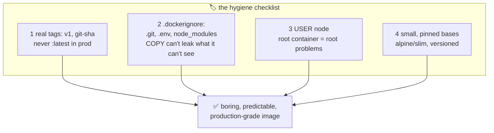

# 🏷️ Lesson 08 — Image hygiene: label your boxes, don't pack your keys

**📍 You are here:** Lesson **08** of 12 — end of Part 1! · Previous: `lesson-07-multi-stage` · Next: `lesson-09-registries`

---

## 📦 What's in this branch

Lessons 01–07, **plus**: the four habits that make an image production-grade.
Real files:

- [app/.dockerignore](../../app/.dockerignore) — the bouncer at the build-context door
- [app/Dockerfile](../../app/Dockerfile) — `USER node` and a pinned base, already in place

## 🧒 Explain like I'm 5

Four school rules for lunchboxes:

1. **Label boxes properly** 🏷️ — write *"Aarav, Tuesday, dal-rice"*, not just
   *"newest"*. Because "newest" changes meaning every day! In Docker:
   `hello-school:v1` or `:abc123` (a git commit), never rely on `:latest` in
   production — you can't roll back to "latest", and you never know what it
   was yesterday. (The k8s and ArgoCD courses both depend on this rule.)
2. **Don't pack your house keys** 🙈 — mom checks what goes in the box.
   `.dockerignore` keeps `.git`, `.env`, secrets and junk out of `COPY`'s
   reach. Remember lesson 02: whatever enters a layer is in the cake
   **forever** — even "deleted" files live on in earlier layers.
3. **The box belongs to the kid, not the principal** 👤 — `USER node`. If a
   bully breaks into a root container, they're the principal of that box (and
   maybe the school). Break into a `node`-user box? They're… a kid at a desk.
4. **Small boxes only** 🪶 — `node:20-alpine` (~180MB) over `node:20`
   (~1.1GB). Less to pull, less to patch, less to attack. Pin versions:
   `FROM node:20-alpine`, never bare `FROM node`.

## 🗺️ Diagram



## ❓ What

- **Tags are mutable pointers** — `:latest` is just a tag someone moved last.
  Deploys must reference an exact version (ECR can even *forbid* tag
  overwrites — `IMMUTABLE`, lesson 10).
- **Build context** = everything COPY *could* see. `.dockerignore` shrinks it:
  faster builds, no accidental secrets, no cache-busting from junk files.
- **Secrets never go in layers** — not in `COPY`, not in `ENV`, not "deleted
  later". Runtime env vars (`-e`, k8s Secrets) exist for exactly this.
- **Non-root by default**: the `node` images ship a ready `node` user; many
  images have equivalents, or add your own with `adduser`.

## 🤔 Why

Every rule here prevents a specific real incident: un-rollback-able deploys
(:latest), leaked credentials (context/git in image), container-escape blast
radius (root), and CVE-hoarding gigabyte images. Part 2 ships images to a
registry other machines trust — hygiene is what makes that trust deserved.

## 🧪 Try it

```bash
# 1) prove .dockerignore works — try to leak a "secret":
echo "SECRET_KEY=dont-pack-me" > app/.env
docker build -t hygiene-test app/
docker run --rm hygiene-test ls -a        # no .env in the box 🙅 (it's ignored)
rm app/.env

# 2) prove we're not root:
docker run --rm hello-school:v1 whoami     # node 👤

# 3) feel the tag rule:
docker tag hello-school:v1 hello-school:latest
docker tag hello-school:v1 hello-school:2026-09-09
docker image ls hello-school               # 3 labels, ONE image (same ID) —
                                           # tags are stickers, not copies
```

## ⏭️ Next — Part 2 begins ☁️

Your image is small, clean, labeled… and trapped on your laptop. Time to ship
it somewhere every machine can pull from: **registries**.

```bash
git checkout lesson-09-registries
```
