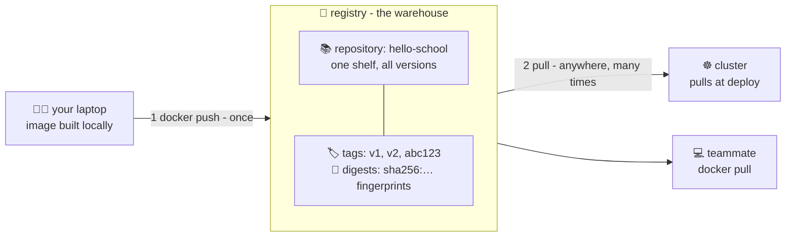

# 🏬 Lesson 09 — Registries: the frozen-lunchbox warehouse

**📍 You are here:** Lesson **09** of 12 — Part 2 begins! · Previous: `lesson-08-image-hygiene` · Next: `lesson-10-ecr-setup`

---

## 📦 What's in this branch

Lessons 01–08, **plus**: the bridge from laptop to cloud — what a **registry**
is, and the pull/push/tag/digest vocabulary Part 2 lives on.

## 🧒 Explain like I'm 5

Your lunchbox is perfect — but it's in YOUR fridge. The school cafeteria
(a server), your teammate, a whole cluster of hungry machines… none of them
can reach your fridge. 🧊🚫

Enter the **frozen-lunchbox warehouse** 🏬 (a registry):

- You **deliver** your box once (`docker push`).
- Anyone allowed can **collect** a copy (`docker pull`) — from anywhere.
- The warehouse has **shelves** (repositories) — one shelf per app:
  the `hello-school` shelf holds ALL versions of that one app.
- Every box on the shelf has a **label** (tag: `v1`, `abc123`) and a
  **fingerprint** (digest: `sha256:…`). Labels can be moved by humans;
  fingerprints can't lie — pull by fingerprint and you get *byte-for-byte*
  that exact box, forever.

You've been using a warehouse all along! `FROM node:20-alpine` pulls from
**Docker Hub** — the giant public warehouse. Part 2 is about getting your own
**private** one (ECR), because your company's lunches aren't for strangers. 🔐

## 🗺️ Diagram



## ❓ What

- **Registry** (the warehouse: Docker Hub, ECR, GHCR…) →
  **repository** (one app's shelf) → **tags/digests** (the boxes).
- A full image name is really an address:
  `REGISTRY/REPOSITORY:TAG` — e.g. `docker.io/library/node:20-alpine`.
  No registry part = Docker Hub is assumed. That's the whole magic.
- **Push/pull are layer-smart** (lesson 02 pays off): only layers the other
  side doesn't already have travel the wire. Small layers = fast ships.
- **Tag vs digest**: tags are movable stickers (mutable); digests are
  content fingerprints (immutable). CI systems and careful deploys pin
  digests; humans read tags.

## 🤔 Why

The registry is the **handoff point of the entire trilogy**: this course
pushes to it, the k8s course's Deployments pull from it, the ArgoCD course
commits its addresses into git. It's also the natural **security boundary**
(who may push? who may pull?) and the **cache** that makes a 50-machine
cluster not download from your laptop.

## 🧪 Try it

```bash
# you already speak registry — see today's pulls:
docker pull node:20-alpine                 # from Docker Hub, layer by layer
docker pull node:20-alpine                 # again: "Already exists" — layer cache!

# read image ADDRESSES like a pro:
docker image inspect node:20-alpine --format '{{index .RepoDigests 0}}'
# → docker.io/library/node@sha256:…  ← warehouse/shelf@fingerprint

# a real private-warehouse dry run — run a registry IN a container (how meta):
docker run -d -p 5000:5000 --name warehouse registry:2
docker tag hello-school:v1 localhost:5000/hello-school:v1     # readdress the box
docker push localhost:5000/hello-school:v1                    # deliver
docker rmi localhost:5000/hello-school:v1
docker pull localhost:5000/hello-school:v1                    # collect — full circle 🎉
docker rm -f warehouse
```

## ⏭️ Next

Now the real thing: your own locker at the AWS bank — **creating an ECR
repository** and getting through its front door.

```bash
git checkout lesson-10-ecr-setup
```
