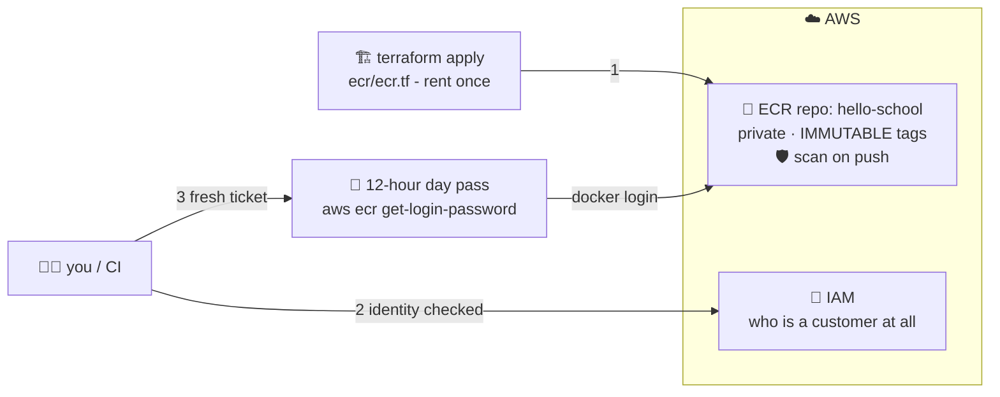

# 🏦 Lesson 10 — ECR setup: renting the bank locker

**📍 You are here:** Lesson **10** of 12 · Previous: `lesson-09-registries` · Next: `lesson-11-push-pull-lifecycle`

---

## 📦 What's in this branch

Lessons 01–09, **plus**: creating your **private ECR repository** and
understanding its two-key security. Real files:

- [ecr/ecr.tf](../../ecr/ecr.tf) — the locker as Terraform code (immutable tags, scan-on-push)
- [ecr/lifecycle-policy.json](../../ecr/lifecycle-policy.json) — the janitor rules (lesson 11 explains)

## 🧒 Explain like I'm 5

Docker Hub is a public warehouse — fine for `node:20-alpine`, wrong for your
company's lunches. You want a **locker at the bank** 🏦: private, guarded,
yours. Getting in involves TWO checks, and people always confuse them:

1. **Are you a bank customer at all?** 🪪 That's **IAM** — your AWS identity
   and its permissions (`ecr:*` actions). No AWS credentials, no
   conversation. This is long-lived and set up once.
2. **The day pass** 🎫 — even as a customer, the locker room wants a fresh
   ticket: `aws ecr get-login-password` prints a token that's valid for
   **12 hours**, and you feed it to `docker login`. Tomorrow? New ticket.
   (This is why CI pipelines log in *every run* — remember the k8s course's
   CircleCI job doing exactly this.)

And how do you rent the locker? Best answer: **as code** —
[ecr/ecr.tf](../../ecr/ecr.tf) declares it (with `IMMUTABLE` tags: a label,
once glued, can never be silently re-glued onto a different box — hygiene
rule #1 enforced by the bank itself 🏷️🔒).

## 🗺️ Diagram



## ❓ What

- An **ECR repository** holds one app's images (the shelf). Address:
  `ACCOUNT_ID.dkr.ecr.REGION.amazonaws.com/hello-school`
  — the region is part of your locker's street address.
- `image_tag_mutability = "IMMUTABLE"` — pushing `v1` twice fails. Tags
  become trustworthy; rollbacks become honest.
- `scan_on_push = true` — the bank X-rays every box on arrival (lesson 12).
- **Cost**: storage ~$0.10/GB-month, private repos themselves free. With
  lesson 07's small images + lesson 11's janitor: pennies.

## 🤔 Why

Private images need a private, IAM-guarded, region-local warehouse — and EKS
nodes pull from ECR with their own IAM role, no passwords anywhere (the bank
recognizes its own staff). Renting it *as code* keeps Part 2 consistent with
everything this trilogy preaches: infrastructure declared, versioned,
reviewable.

## 🧪 Try it (needs an AWS account + AWS CLI configured)

```bash
# rent the locker — pick ONE of the two:
cd ecr && terraform init && terraform apply          # as code (recommended)
# or the one-liner:
aws ecr create-repository --repository-name hello-school \
  --image-tag-mutability IMMUTABLE \
  --image-scanning-configuration scanOnPush=true

# your locker's address (save it — lesson 11 uses it constantly):
aws ecr describe-repositories --repository-names hello-school \
  --query 'repositories[0].repositoryUri' --output text
# → 123456789012.dkr.ecr.ap-south-1.amazonaws.com/hello-school

# the day pass 🎫:
aws ecr get-login-password --region ap-south-1 \
  | docker login --username AWS --password-stdin \
    123456789012.dkr.ecr.ap-south-1.amazonaws.com     # "Login Succeeded"
```

## ⏭️ Next

Locker rented, pass in hand. Time to actually **file boxes in it** — tag,
push, pull — and meet the janitor who keeps it tidy.

```bash
git checkout lesson-11-push-pull-lifecycle
```
