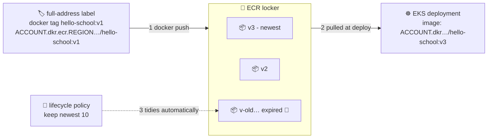

# 🧹 Lesson 11 — Push, pull & lifecycle: filing boxes and the janitor

**📍 You are here:** Lesson **11** of 12 · Previous: `lesson-10-ecr-setup` · Next: `lesson-12-ci-to-cloud`

---

## 📦 What's in this branch

Lessons 01–10, **plus**: the daily ECR workflow — **tag with the full
address, push, pull** — and the **lifecycle policy** that stops your locker
from filling up with ancient lunches. Real file:

- [ecr/lifecycle-policy.json](../../ecr/lifecycle-policy.json) — "keep the newest 10, toss the rest"

## 🧒 Explain like I'm 5

Filing a box at the bank has one rule people always trip on: **the label must
carry the FULL address** 🏷️. The bank won't accept a box labeled just
`hello-school:v1` — which bank? which branch? which locker? The label must say:

> `123456789012.dkr.ecr.ap-south-1.amazonaws.com/hello-school:v1`
> *(bank · branch · locker · box name)*

That's what `docker tag` does — it doesn't copy anything, it just writes a
second, fully-addressed label on the same box. Then `docker push` reads the
label and knows exactly where to deliver.

And the **janitor** 🧹: every push adds a box, forever. A year of daily
deploys = 365 boxes of mostly-mummified lunch, and the bank charges by the
shelf-centimeter. The [lifecycle policy](../../ecr/lifecycle-policy.json) is
standing instructions to the janitor: *"keep the newest 10 boxes; quietly
expire the rest."* Set once, tidy forever.

## 🗺️ Diagram



## ❓ What

- `docker tag SOURCE FULL_ADDRESS:TAG` — same image ID, new fully-qualified
  name. Push destination is *encoded in the name* — that's the whole trick.
- **Pushes are layer-smart**: only layers ECR doesn't have travel (lesson 02
  and lesson 07 pay off: small layers = 2-second pushes).
- **Pulling from EKS**: the k8s course's `deployment.yaml` gets its
  `IMAGE_PLACEHOLDER` replaced with exactly this address — nodes pull with
  their IAM role, no docker login needed on the cluster.
- **Lifecycle rules** match by count or age, and can protect tag prefixes
  (e.g. always keep `release-*`). JSON in git → applied by
  [ecr/ecr.tf](../../ecr/ecr.tf) — the janitor's contract is code-reviewed.

### 🧠 Tag vs digest — and an *example* lifecycle policy

```text
tag     =  human-friendly name        my-app:v42        (mutable — can be re-pointed)
digest  =  content identity           sha256:abc123…    (immutable — the exact bytes)

my-app:v42  ──resolves today to──▶  sha256:abc123…
```

Production deployments often pin the **digest** (or use immutable tags)
because a tag can be moved to different content after you tested it; a
digest cannot. Kubernetes accepts `image: repo@sha256:…` for exactly this.

ECR has **no default janitor**. A lifecycle policy is something *you* write —
for example: *"keep the newest 10 tagged images; expire untagged images
after 7 days."* Pick numbers that match your rollback needs.

## 🤔 Why

This lesson IS the deploy path: everything Part 1 built becomes *available to
the cluster* here. And the janitor matters more than it looks: unbounded
registries cost real money, slow scans, and hide which images actually matter.
"Newest 10 + protected releases" is the boring, correct default.

## 🧪 Try it

```bash
REPO=$(aws ecr describe-repositories --repository-names hello-school \
  --query 'repositories[0].repositoryUri' --output text)     # your locker address

# 1) file a box: full-address label → push
docker tag hello-school:v1 "$REPO:v1"
docker push "$REPO:v1"                       # watch layers upload (then re-push: instant)

# 2) prove it's really there — pull it back as a stranger would:
docker rmi "$REPO:v1"
docker pull "$REPO:v1" && echo "round trip complete 🎉"

# 3) test IMMUTABLE tags (lesson 10's promise):
docker push "$REPO:v1" 2>&1 | tail -1        # rejected? no — identical bytes are fine.
# now change the app, rebuild, and try to REUSE v1:
echo "// changed" >> app/server.js && docker build -t "$REPO:v1" app/ && git checkout app/server.js
docker push "$REPO:v1" 2>&1 | tail -1        # ❌ "tag invalid: The image tag 'v1' already exists"

# 4) read the janitor's contract:
aws ecr get-lifecycle-policy --repository-name hello-school --query lifecyclePolicyText --output text
```

### ⚠️ Common mistakes

- treating a tag as a guarantee — only a digest identifies exact content
- assuming ECR cleans up by itself — write the lifecycle policy (and read the bill)
- an aggressive policy that expires the image production is *currently running* on

## ⏭️ Next

You just did tag → login → push by hand. The final lesson hands the whole
routine to a robot — and passes the baton to the next two courses.

```bash
git checkout lesson-12-ci-to-cloud
```
