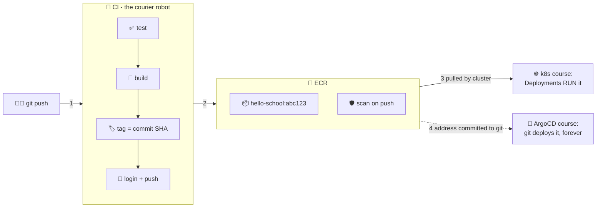

# 📮 Lesson 12 — CI to cloud: the courier files the copies

**📍 You are here:** Lesson **12** of 12 — the final lesson! · Previous: `lesson-11-push-pull-lifecycle`

> 🔗 **Next:** Kubernetes pulls this image from ECR — the Kubernetes school's lesson 01 starts exactly where this one ends.

---

## 📦 What's in this branch

All 12 lessons — the complete course. The finale: handing lessons 1–11 to a
**robot** that does them on every push, plus the scan report, plus the baton
pass to the rest of the trilogy.

## 🧒 Explain like I'm 5

Look at what you did by hand yesterday: build 🍱 → label with the full
address 🏷️ → get the day pass 🎫 → push 📦. Four commands, every deploy,
forever? No. That's a job for the **courier robot** 📮 (CI):

On every `git push`, the robot:

1. **Checks the homework** ✅ — runs the tests. Bad code never gets boxed.
2. **Bakes the box** 🍱 — `docker build`, cache-fast thanks to lesson 02.
3. **Labels it with the commit's fingerprint** 🏷️ — the tag IS the git SHA
   (`hello-school:abc123`), so every box on the shelf answers "which code is
   this?" *by name*. (And IMMUTABLE tags mean nobody can ever lie about it.)
4. **Gets its own day pass and files the box** 🎫📦 — fresh ECR login each
   run, push, done.
5. **The bank X-rays the box** 🛡️ — scan-on-push lists known vulnerabilities
   (CVEs) in your layers. Small alpine images (lesson 07/08) keep this report
   blissfully short.

This is *exactly* what the
[k8s course's CircleCI pipeline](https://github.com/BaluRaut/learn-kubernetes-school/blob/main/.circleci/config.yml)
does for its two services — you can now read that file fluently. 🎓

## 🗺️ Diagram



## ❓ What (a real GitHub Actions example)

```yaml
# .github/workflows/ship.yml — illustrative; store AWS creds as CI secrets
on: { push: { branches: [main] } }
jobs:
  ship:
    runs-on: ubuntu-latest
    steps:
      - uses: actions/checkout@v4
      - run: docker build -t app app/                     # 🍱 (tests would run first)
      - uses: aws-actions/configure-aws-credentials@v4
        with: { aws-region: ap-south-1,
                role-to-assume: arn:aws:iam::ACCOUNT:role/ci-ecr-push }  # 🪪 no long-lived keys
      - run: |
          REPO=ACCOUNT.dkr.ecr.ap-south-1.amazonaws.com/hello-school
          aws ecr get-login-password | docker login --username AWS --password-stdin "$REPO"  # 🎫
          docker tag app "$REPO:${GITHUB_SHA::7}"          # 🏷️ tag = commit
          docker push "$REPO:${GITHUB_SHA::7}"             # 📦
```

- **Tag = commit SHA** is the load-bearing convention: it makes deploys
  traceable (k8s course) and GitOps commits meaningful (ArgoCD course).
- **OIDC role assumption** (`role-to-assume`) beats storing AWS keys in CI —
  the modern version of the day pass.

### 🧠 The capstone — the whole pipeline in one picture

```text
Developer
    │  git push
    ▼
CI  ── test ── docker build ── scan ── tag (commit SHA) ── push
                                                            │
                                                            ▼
                                                          ECR
                                                            │  image pull (IAM role)
                                                            ▼
                                                      Kubernetes
                                                            │  desired state from git
                                                            ▼
                                                        ArgoCD
```

> **Docker builds the artifact. ECR stores the artifact. Kubernetes runs the
> artifact. ArgoCD manages the deployment.**

### 🎓 Graduation test — can you explain this?

> *A developer pushes code to Git. CI builds a Docker image, scans it and
> pushes it to ECR. Kubernetes later pulls that image and runs it. ArgoCD
> makes sure the Kubernetes configuration matches Git.*

1. Where is the source code?
2. What creates the image?
3. What is inside the image?
4. Where is the image stored?
5. What identifies an *exact* image?
6. Who is allowed to push to ECR?
7. Who is allowed to pull from ECR?
8. Who actually runs the container?
9. What happens if the image tag changes?
10. Where does ArgoCD fit?

If every answer comes out in one sentence, you are done with this school.

## 🤔 Why

Manual shipping has the same disease as manual deploying (ArgoCD course,
lesson 01): it depends on a human remembering. The robot makes every image
tested, labeled, scanned, and filed — identically, forever. Your job shrinks
to writing code and reading scan reports.

## 🧪 Try it

```bash
# read a real scan report from your lesson-11 push:
aws ecr describe-image-scan-findings --repository-name hello-school \
  --image-id imageTag=v1 --query 'imageScanFindings.findingSeverityCounts'
# alpine base → usually a very short list 🪶

# cleanup when done playing (stop the pennies):
# terraform -chdir=ecr destroy     # or:
# aws ecr delete-repository --repository-name hello-school --force
```

### ⚠️ Common mistakes

- tagging CI images `latest` instead of the commit SHA — deploys become unreproducible
- CI pushing with long-lived AWS keys — OIDC → role instead
- skipping the scan step "for speed" — the one step that costs seconds and saves incidents

## 🎓 The trilogy — where you are now

**You've completed course 1 of 3:** your code becomes a tested, tiny,
labeled, scanned image sitting in a private registry, automatically. Next:

1. ☸️ **[Learn Kubernetes School](https://github.com/BaluRaut/learn-kubernetes-school)** —
   a cluster RUNS your images: pods, services, autoscaling, rollouts.
2. 🤖 **[Learn ArgoCD School](https://github.com/BaluRaut/learn-argocd-school)** —
   git DEPLOYS them: the caretaker robot, self-heal, 10-second rollbacks.

Pack it. Run it. Ship it forever. 🍱☸️🤖

```bash
git checkout main
```
